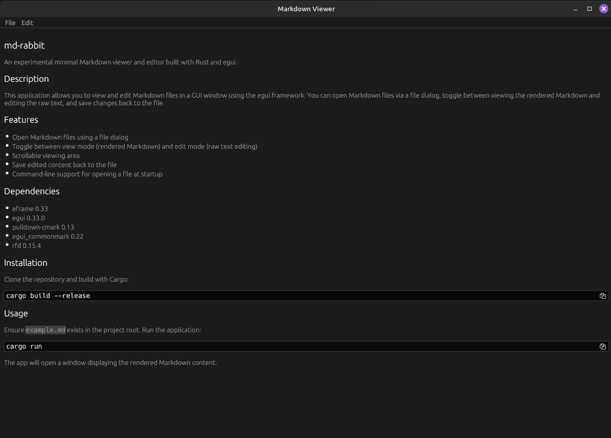

# md-rabbit

[](https://www.rust-lang.org/)

An experimental minimal Markdown viewer and editor built with Rust and egui.

## Screenshot



## Description

This application allows you to view and edit Markdown files in a GUI window using the egui framework. You can open Markdown files via a file dialog, toggle between viewing the rendered Markdown and editing the raw text, and save changes back to the file.

## Features

- Open Markdown files using a file dialog
- Toggle between view mode (rendered Markdown) and edit mode (raw text editing)
- Scrollable viewing area
- Save edited content back to the file
- Command-line support for opening a file at startup

## Dependencies

### Cargo Dependencies

- [eframe](https://crates.io/crates/eframe) 0.33
- [egui](https://crates.io/crates/egui) 0.33.0
- [pulldown-cmark](https://crates.io/crates/pulldown-cmark) 0.13
- [egui_commonmark](https://crates.io/crates/egui_commonmark) 0.22
- [rfd](https://crates.io/crates/rfd) 0.15.4

### System Dependencies

- libgtk-3-dev
- libglib2.0-dev

If system dependencies are not available, run `./install-requirements.sh` to install them.

## Installation

Clone the repository and build with Cargo:

```sh
cargo build --release
```

## Usage

Run the application:

```sh
cargo run --release
```

Run the application and open file directly:

```sh
cargo run --release -- /path/to/markdown-file.md
```

The app will open a window displaying the rendered Markdown content.